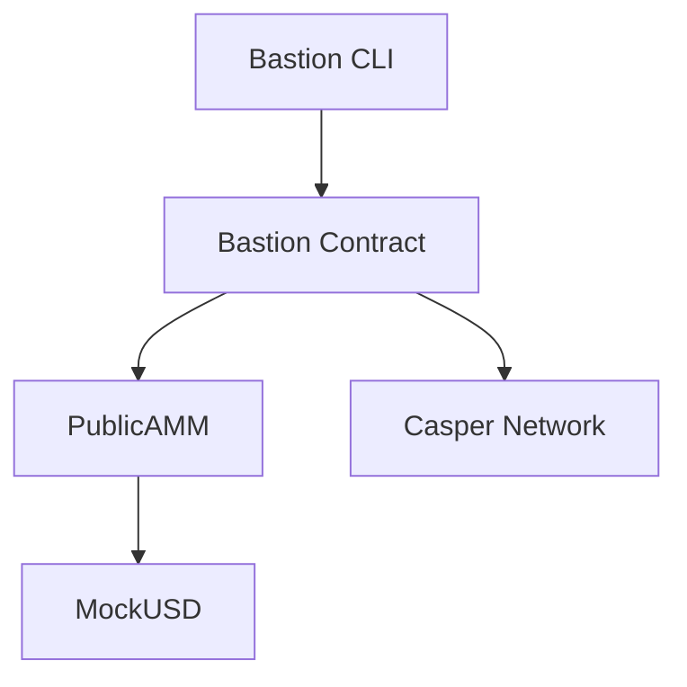

# Bastion

Privacy-preserving dark pool trading protocol on Casper Network with ZK proofs and AMM integration.

## Quick Install

**Linux / macOS:**

```bash
curl -fsSL https://raw.githubusercontent.com/krishnagoyal099/bastion/main/install.sh | bash
```

**Windows (via WSL):**

```powershell
# Step 1: Open PowerShell as Administrator and install WSL
wsl --install

# Step 2: Restart your computer

# Step 3: Open Ubuntu from Start Menu and run
curl -fsSL https://raw.githubusercontent.com/krishnagoyal099/bastion/main/install.sh | bash
```

After installation, restart your terminal and run:

```bash
bastion
```

## Requirements

| Dependency | Purpose |
|------------|---------|
| curl | Downloading files |
| git | Version control |
| jq | JSON processing |
| gum | Interactive UI (auto-installed) |

The installer will automatically install `gum` if not present.

## Manual Installation

```bash
# Clone repository
git clone https://github.com/krishnagoyal099/bastion.git
cd bastion

# Run directly
chmod +x bastion-cli.sh
./bastion-cli.sh
```

## Features

| Feature | Description |
|---------|-------------|
| Dark Limit Orders | Hidden price and quantity until execution |
| AMM Integration | Liquidity provision and instant swaps |
| ZK Proofs | Privacy-preserving order verification |
| Whale Detection | Large wallet movement tracking |
| Arbitrage Scanner | Cross-DEX opportunity detection |
| Price Ticker | Real-time market data |

## Architecture



## Configuration

Create `~/.bastion/.env` with your settings:

```bash
CASPER_RPC_URL="https://rpc.testnet.casperlabs.io/rpc"
CASPER_CHAIN_NAME="casper-test"
PRIVATE_KEY_PATH="~/.bastion/keys/secret_key.pem"
```

## Uninstall

```bash
curl -fsSL https://raw.githubusercontent.com/krishnagoyal099/bastion/main/install.sh | bash -s -- --uninstall
```

Or manually:

```bash
rm -rf ~/.bastion ~/.local/bin/bastion
```

## Project Structure

```
~/.bastion/
├── bastion-cli.sh      # Main entry point
├── cli/
│   ├── lib/            # Feature modules
│   └── config/         # Configuration
└── keys/               # Local key storage
```

## Supported Platforms

| Platform | Status |
|----------|--------|
| Linux (x86_64) | Supported |
| Linux (ARM64) | Supported |
| macOS (Intel) | Supported |
| macOS (Apple Silicon) | Supported |
| Windows (via WSL) | Supported |

## License

MIT License

---

**Bastion Protocol** - Dark Pool Trading on Casper Network
