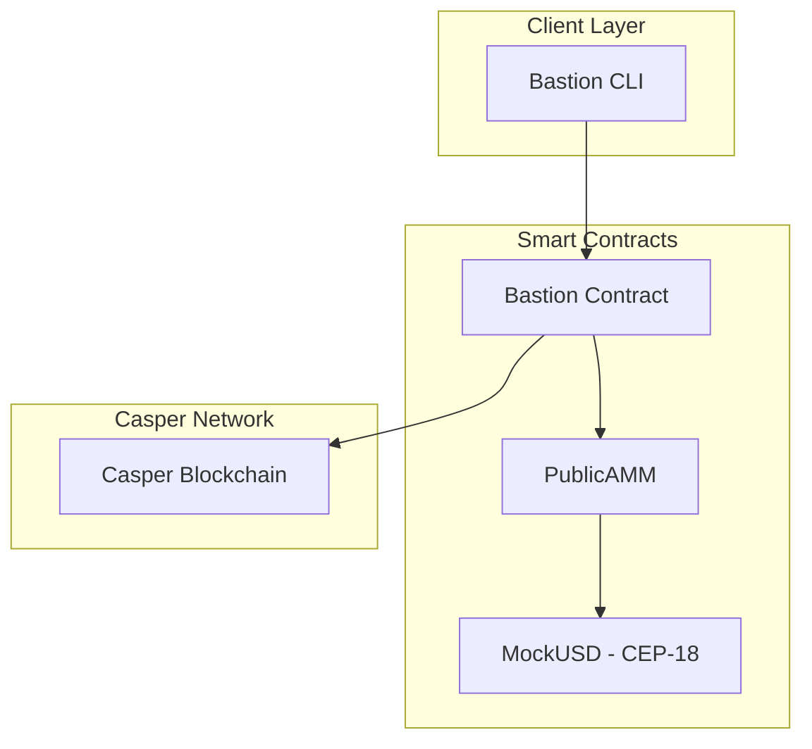

# Bastion

A privacy-preserving dark pool trading protocol built on the Casper Network. Bastion enables institutional-grade order execution with zero-knowledge proofs, protecting traders from front-running and MEV extraction.

## Overview

Bastion addresses critical challenges in decentralized trading by implementing a dark pool mechanism where order details remain hidden until execution.

| Issue | Impact | Bastion Solution |
|-------|--------|------------------|
| Front-running | Traders receive worse execution prices | Orders encrypted until matching |
| MEV Extraction | Value extracted by block producers | Time-locked commit-reveal scheme |
| Information Leakage | Market moves against large orders | Zero-knowledge order proofs |

---

## Architecture



---

## Features

| Feature | Description | Status |
|---------|-------------|--------|
| Dark Limit Orders | Hidden price and quantity until execution | Available |
| AMM Integration | Liquidity provision and swaps | Available |
| ZK Proofs | Privacy-preserving order verification | Available |
| Whale Detection | Large wallet tracking | Available |

---

## Installation

### Prerequisites

| Requirement | Minimum Version |
|-------------|-----------------|
| Rust | 1.73.0 |
| casper-client | 2.0.0 |
| gum | 0.13.0 |

### Build from Source

```bash
git clone https://github.com/krishnagoyal099/bastion.git
cd bastion

# Build smart contracts
cd contract
cargo build --release --target wasm32-unknown-unknown

# Run CLI
chmod +x bastion-cli.sh
./bastion
```

---

## Smart Contracts

| Contract | Purpose | Language |
|----------|---------|----------|
| Bastion | Dark pool order management | Rust / Odra |
| PublicAMM | Automated market maker | Rust / Odra |
| MockUSD | Test token (CEP-18) | Rust |

---

## Configuration

Create a `.env` file in the project root:

```bash
CASPER_RPC_URL="https://rpc.testnet.casperlabs.io/rpc"
CASPER_CHAIN_NAME="casper-test"
PRIVATE_KEY_PATH="./keys/secret_key.pem"
```

---

## Project Structure

```
bastion/
├── contract/           # Bastion smart contract
├── amm_contract/       # PublicAMM smart contract
├── cep18/              # CEP-18 token implementation
├── cli/                # Terminal interface
│   └── lib/            # Module implementations
└── keys/               # Local key storage
```

---

## Security

| Threat | Mitigation |
|--------|------------|
| Order front-running | Encrypted order submission |
| Block producer MEV | Time-locked reveal |
| Key compromise | Hardware wallet support |

---

## License

This project is licensed under the MIT License.

---

**Bastion Protocol** - Privacy-Preserving Dark Pool Trading on Casper Network
